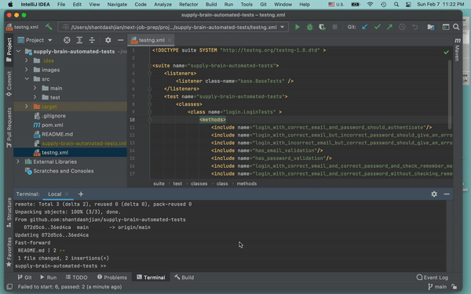

# supply-brain-automated-tests
Automated tests for the Supply Brain login functionality, built with Selenium and TestNG

## In This Document:
1. [Application Under Test URL](#application-under-test-url)
2. [Prerequisites to Run the Automated Tests](#prerequisites-to-run-the-automated-tests)
3. [How to Run the Tests in `IntelliJ`](#how-to-run-the-tests-in-intellij)
4. [How to Run the Tests in `Terminal`](#how-to-run-the-tests-in-terminal)
5. [Test Results Report](#test-results-report)
6. [Technologies Used](#technologies-used)
7. [Development Approach](#development-approach)
8. [Issues and Learning Points](#issues-and-learning-points)

## Application Under Test URL
https://api-demo.supplybrain.io/login

## Prerequisites to Run the Automated Tests
1. `Java 8+`
2. `Maven 3.6`
3. IDE like `IntelliJ` or `Eclipse` (Optional)

## How to Run the Tests in `IntelliJ`
1. Clone or downlaod this repository.
2. Open the project in `IntelliJ`.
3. Either right click on `testng.xml > Run ...`.
4. Or in the `Maven Tool Window`, run the Maven `Lifecycle > Install` task.

## How to Run the Tests in `Terminal`
1. Clone or downlaod this repository.
2. `> cd supply-brain-automated-tests`
3. `> mvn install`

## Test Results Report
  * Running the automated tests will generate a test results report which will include screenshots of any failed tests.
  * In your browser, open `test-output/emailable-report.html`.
  

## Technologies Used
  * Java
  * Selenium
  * TestNJ
  * Maven

## Development Approach
1. Begin with exploratory testing to learn.
2. Jot down the key test scenarios: login with email and password, email and password validation, remember me, and forgot password.
3. In IDE, create a new Maven project.
4. Add `Selenium` and `TestNG` dependencies.
5. In the `test` folder, create your base tests class and login tests class.
6. Write a test case, annotated with `@Test`. Start with the happy path test case for the first test scenario.
7. Using the [Page Object Model design pattern](https://www.selenium.dev/documentation/en/guidelines_and_recommendations/page_object_models/
), create a class to model each page in the application under test.
8. For each page class, add fields for mechanisms to locate `DOM` elements, and methods for interacting with those elements. 
9. Use the browser's `Developer Tools` to find the mechanisms to locate `DOM` elements.
10. Run the test case and see it working as expected.
11. Do any refactoring necessary.
12. Commit your changes in `git`.
13. Repeat steps 6-12 till you reach the level of automation coverage desired for your test scenraions. After adding the happy path case for each test scenario, add the edge cases, then move on to the next test scenario.
  
## Issues and Learning Points
  ### Testing *Remember Me* functionality:
  * **Issue:** Closing the Selenium `WebDriver` instance leads to loss of all cookies in that session. Instantiating a new instance of the `driver` did not remember the cookies from the previous session.
  * **Solution:** After doing some research and using reasoning and trial and error, I learned a technique to mimic the browser behavior of remembering cookies after closing the browser window. It consists of:
    1. Save the cookies of the session.
    2. Close the `driver`
    3. Instantiate a new `driver` instance.
    4. Get to the URL.
    4. Delete any new cookies from the app.
    5. Add cookies saved from the previous session.
    6. Go to the same URL one more time, now with the cookies from the previous session for that domain in place.
  

  ### Slowing Down the Automation for Demo Purposes:
  * **Issue:** Selenium is fast. When demoing the automated tests, I wanted to slow it down.
  * **Solution:** I added a class `AutomationEventSpeedChanger` that implements `WebDriverEventListener` and registered it when instantiating the `driver`. This class can be used to add an optional delay in milliseconds before and after each automation event like `click`, `sendKeys`, etc. This way I was able to slow down the automation when demoing it and describe each test case as it was running.
  

[Up](README.md)

